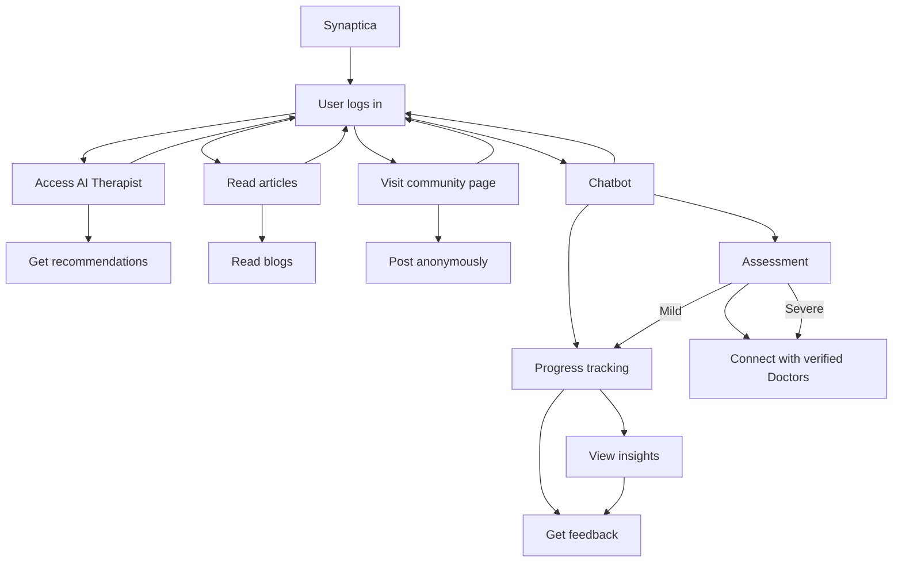

# Hack-o-octo
Hack-o-octo ( Team- Code Blooded) - Synaptica
# Synaptica - AI-Powered Mental Health Support Platform 🧠

## About The Project

Synaptica is an innovative mental health support platform that combines AI technology, community support, and professional guidance to make mental healthcare more accessible, affordable, and stigma-free.

## 🎯 Core Features

### 1. AI Therapeutic Assistant
- **Smart Assessment**: Initial evaluation of mental health concerns
- **Severity Classification**: Determines if conditions are mild or severe
- **Personalized Recommendations**: Tailored guidance based on user interactions
- **Professional Referral System**: Connects users to verified therapists when needed

### 2. Specialized Mental Health Communities
- **8 Major Focus Areas**:
  - Mood Disorders
  - Anxiety Disorders
  - Personality Disorders
  - Psychotic Disorders
  - Repetitive Disorders
  - Eating Disorders
  - Autism
  - PTSD
- **Features**:
  - Anonymous discussions
  - Peer support groups
  - Verified professional moderators
  - Premium one-on-one consultation options

### 3. Progress Tracking System
- **Smart Journaling**: AI-powered journal entry analysis
- **Progress Metrics**: Quantifiable improvement tracking
- **Treatment Effectiveness**: Monitoring and feedback on intervention success
- **Insight Generation**: Personalized reports and recommendations

## 💡 Business Model

### Value Proposition
- Accessible mental health support
- Reduced barriers to seeking help
- Affordable initial assessment
- Community-based support system
- Professional guidance when needed

### Revenue Streams
1. Premium Consultations
2. Subscription-based Features
3. Healthcare Provider Partnerships
4. Insurance Company Collaborations

### Market Opportunity
- Growing global mental health awareness
- High demand for digital solutions
- Scalable freelance model for professionals
- Built-in quality assurance system


## 🔄 User Flow

### Main User Journey

## 🛠 Technology Stack

### Frontend
- **React.js**: Core frontend framework
- **HTML5/CSS3**: Web markup and styling
- **TailwindCSS**: Utility-first CSS framework
- **Shadcn/ui**: Modern UI component library
- **Chart.js**: Interactive data visualization

### Backend
- **Node.js**: Runtime environment
- **Express.js**: Web application framework
- **PostgreSQL**: Primary database
- **Firebase**: Authentication and real-time features

### Deployment
- **Vercel**: Cloud platform for frontend and backend deployment

### AI/ML Stack
- **PyTorch**: Deep learning framework
- **RegEx**: Pattern matching and text processing
- **Hugging Face**: NLP models and transformers
- **NLTK**: Natural Language Processing toolkit
- **Pandas**: Data manipulation and analysis
- **NumPy**: Numerical computing
- **LangChain**: Large Language Model (LLM) framework
- **LLM**: Language model integration
### System Architecture
```mermaid
graph TD
    A[Frontend - React.js] --> B[Backend - Node.js/Express]
    B --> C[PostgreSQL Database]
    B --> D[Firebase]
    A --> E[AI Services]
    E --> F[PyTorch Models]
    E --> G[LangChain/LLM]
    F --> H[Data Processing]
    H --> I[NLTK/Pandas/NumPy]

